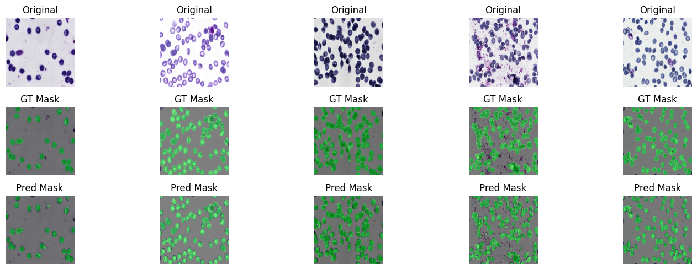

# Blood_Cell_Segmentation

A minimal PyTorch pipeline for segmenting blood cell images. You can change the data to train on your own image/mask pair (although this pipline only works for single class data ie an image cannot contain both cats and dogs, only cats)

---

##  Features

- `DeepLabV3Plus` architecture with `resnet101` encoder
- Custom Dataset support (image + mask pairs)
- Simple training & evaluation loop
- Easy to plug in your own data

---

## Prediction Example

An example of the model output on images:

---

# How to Run
Just press `shift` + `enter` on each cell

